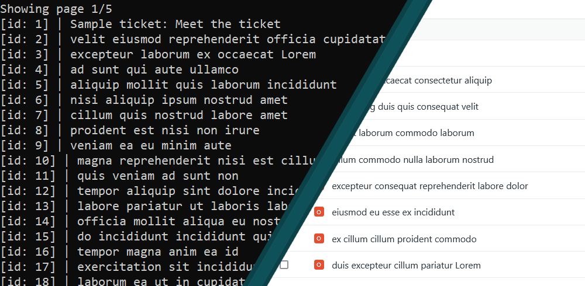

# Zendesk Ticket Viewer
### A command line ticket viewer created by William Cunningham for the Zendesk internship coding challenge

## Installation
1. git clone or download the repository
2. in your terminal, navigate to main.py in the zendesk_ticket_veiwer directory
3. ensure you have python 3.9 installed
4. if the `requests` library is not installed for your python version, run `python -m pip install requests`
5. set up config.txt with your credentials
    - add your subdomain and email
    - either add your password or an api token. If both are added the program will just use the token
    - an example config.txt file:
```
subdomain:zccwill*******
email:will********@gmail.com
token:******************************xduMNi
```
6. run `python main.py`


## Unit testing
1. in your terminal, navigate to main.py in the zendesk_ticket_veiwer directory
2. run `python tests.py`


## Usage
The program fetches all tickets on the user's account, and then allows the user to page through their tickets 25 at a time.
   - enter 'n' or 'next' to navigate to the next page
   - enter 'p' or 'prev' to navigate to the previous page
   - enter 'q' or 'quit' to exit the program
   - enter the id of a ticket to expand it. Any ticket can be viewed at any time regardless of the current page for ease of use.
      
      
## Design Notes
I chose to download all of the tickets at program start in order to reduce the number of api calls per operation. This way, there is only a quick call to download the user information of the ticket submitter on expanding a ticket, and no calls when changing page. I believe this makes for a smoother and cleaner user experience, although if I were working with a larger data set I would opt to download only one page at a time.

Unit tests were created with the standard python `unittest` library, and do not test api connectivity or functionality because that is out of scope for the program itself.
